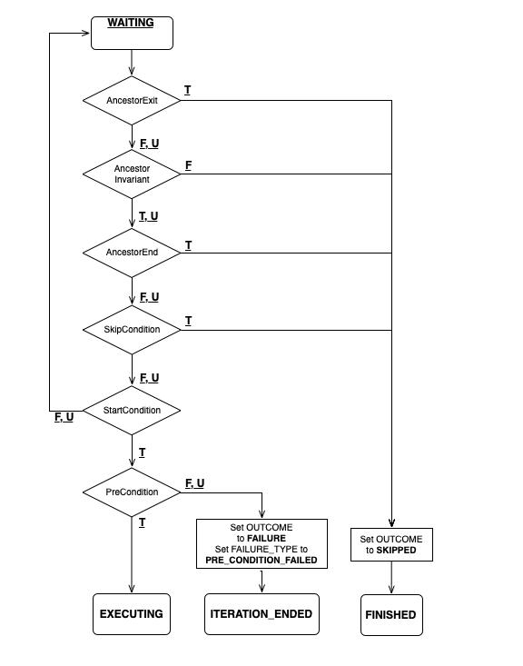
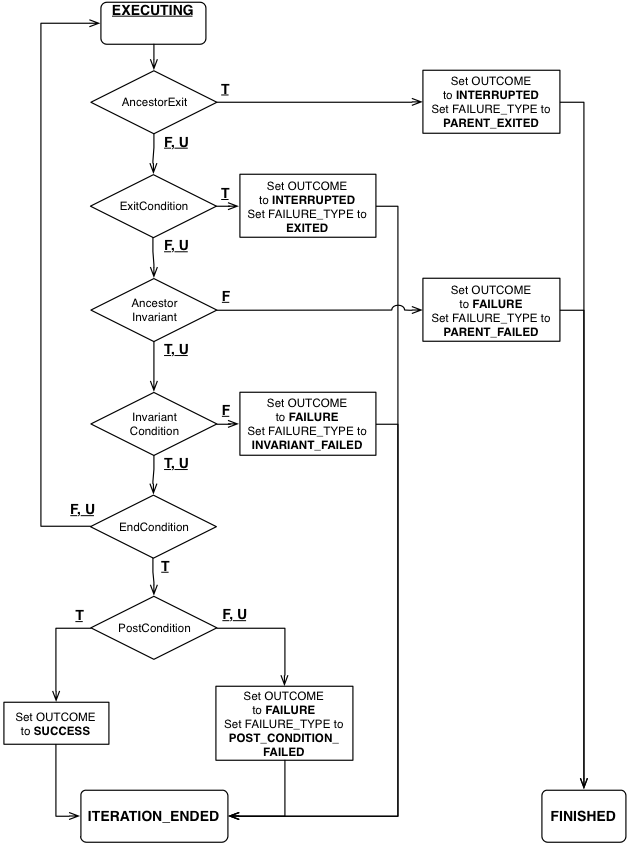
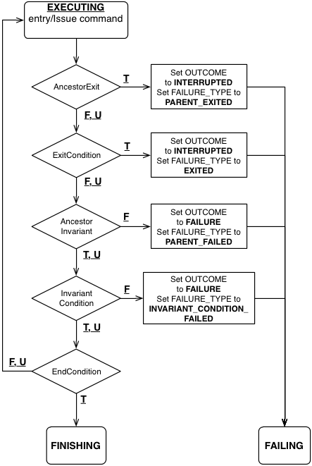

.. _NodeStateDiagrams:

Node State Diagrams
===================

*19 Mar 2024*

These illustrations describe the node state transition semantics of
|PLEXIL| nodes for PLEXIL releases 4.x.

.. contents::

.. _inactive_state:

INACTIVE state
--------------

Nodes of all types in the INACTIVE nodes behave as follows.

.. figure:: ../_static/images/Inactive-plexil4.png

.. _waiting_state:

WAITING state
-------------

There is a small but significant difference in the transition
semantics for the WAITING state between Plexil 4 and Plexil 6.
In Plexil 4, the node's Exit Condition is checked in this state, and
transitions the node to FINISHED if true.

.. figure:: ../_static/images/Waiting-plexil4.png

   Waiting state for all node types in Plexil 4

In Plexil 6, the Exit Condition is *not* checked when the node is
waiting; this was actually the intended semantics when the Exit
Condition was introduced.

   Waiting state for all node types in Plexil 6

.. _executing_state:

EXECUTING state
---------------

.. _executing___empty_nodes:

EXECUTING - Empty nodes
~~~~~~~~~~~~~~~~~~~~~~~

Empty nodes transition directly to ITERATION_ENDED when their
ExitCondition becomes true, or to FINISHED if some ancestor's becomes
true.

.. _executing___assignment_nodes:

EXECUTING - Assignment nodes
~~~~~~~~~~~~~~~~~~~~~~~~~~~~

Assignment nodes transition to FAILING and restore the variable's
previous value if their or some ancestor's ExitCondition becomes true,
or their or some ancestor's InvariantCondition becomes false. Otherwise
Assignment nodes transition to ITERATION_ENDED when the ExitCondition
becomes true; the PostCondition determines the outcome.

.. figure:: ../_static/images/Executing_Assignment_nodes_with_Exit_condition.png

.. _executing___command_nodes:

EXECUTING - Command nodes
~~~~~~~~~~~~~~~~~~~~~~~~~

Command nodes transition to FINISHING in the nominal case. In the event
of an ExitCondition true or InvariantCondition false, they transition to
FAILING to abort the command.

Note that the supplied EndCondition is ORed with
``(command_handle == COMMAND_DENIED || command_handle == COMMAND_FAILED)``
. This allows the node to transition in the event the resource arbiter
rejects the command.

.. _executing___update_nodes:

EXECUTING - Update nodes
~~~~~~~~~~~~~~~~~~~~~~~~

Update nodes behave similarly to Assignment nodes.

Note that the supplied EndCondition is ANDed with update-complete.

.. figure:: ../_static/images/Executing_Update_with_Exit_condition.png

.. _executing___nodelist_and_librarynodecall_nodes:

EXECUTING - NodeList and LibraryNodeCall nodes
~~~~~~~~~~~~~~~~~~~~~~~~~~~~~~~~~~~~~~~~~~~~~~

NodeList and LibraryNodeCall nodes transition to FAILING if their or
some ancestor's ExitCondition becomes true.

Note that the default EndCondition for these node types is all children
in FINISHED state.

.. figure:: ../_static/images/Executing_List_nodes_with_Exit_condition.png

.. _finishing_state:

FINISHING state
---------------

In general, the FINISHING state waits for completion of actions that may
take an indeterminate time. If the node fails while waiting for
completion, it transitions to FAILING.

.. _finishing___command_nodes:

FINISHING - Command nodes
~~~~~~~~~~~~~~~~~~~~~~~~~

.. _finishing___nodelist_and_librarynodecall_nodes:

FINISHING - NodeList and LibraryNodeCall nodes
~~~~~~~~~~~~~~~~~~~~~~~~~~~~~~~~~~~~~~~~~~~~~~

.. figure:: ../_static/images/Finishing_with_Exit_condition.png

.. _failing_state:

FAILING state
-------------

In general, FAILING is used to finish recovery from an abnormal
situation.

.. _failing___assignment_nodes:

FAILING - Assignment nodes
~~~~~~~~~~~~~~~~~~~~~~~~~~

Assignment nodes simply transition to FINISHED or ITERATION_ENDED as
appropriate. The variable has already been restored to its previous
value on the transition into FAILING.

Note that the previous as-implemented behavior was to assign UNKNOWN in
the event of a failure. The entire team agrees that restoring the
previous value is preferable.

.. figure:: ../_static/images/Failing-Assignment-plexil4.png

.. _failing___command_nodes:

FAILING - Command nodes
~~~~~~~~~~~~~~~~~~~~~~~

Command nodes abort the command, wait for the abort to complete, then
transition to FINISHED or ITERATION_ENDED as appropriate.

.. _failing___update_nodes:

FAILING - Update nodes
~~~~~~~~~~~~~~~~~~~~~~

Update nodes simply wait for the update to complete, then transition to
FINISHED or ITERATION_ENDED as appropriate.

.. figure:: ../_static/images/Failing-Update-plexil4.png

.. _failing___nodelist_and_librarynodecall_nodes:

FAILING - NodeList and LibraryNodeCall nodes
~~~~~~~~~~~~~~~~~~~~~~~~~~~~~~~~~~~~~~~~~~~~

NodeList and LibraryNodeCall nodes wait for all children to achieve
either the WAITING or FINISHED state before transitioning to FINISHED or
ITERATION_ENDED.

.. figure:: ../_static/images/Failing_List_node_with_Exit_condition.png

.. _iteration_ended_state:

ITERATION_ENDED state
---------------------

ITERATION_ENDED transitions directly to FINISHED if an ancestor's
ExitCondition becomes true.

.. figure:: ../_static/images/Iteration_Ended_with_Exit_condition.png

.. _finished_state:

FINISHED state
--------------

The Finished state is unchanged from the specification and previous
implemented behavior.

