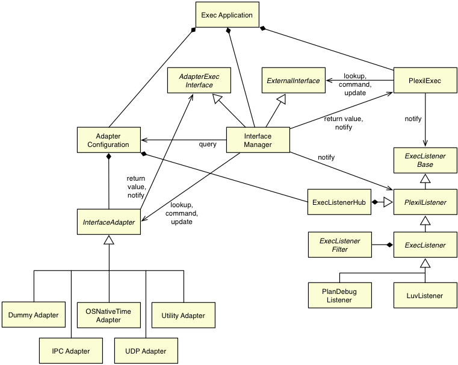

.. _TheApplicationFramework:

The Application Framework
=============================

*21 May 2015*

This section gives a high-level overview of the |PLEXIL| Application
Framework.

.. contents::

Overview
--------

The core of the |PLEXIL| Executive is general and abstract by design. No
top-level loop is provided, nor are any interfaces to external systems
implemented in the core.

The *PLEXIL application framework* provides these essential
capabilities. The framework consists of the ``ExecApplication``,
``InterfaceManager`` and ``AdapterConfiguration`` classes, the
``universalExec`` executable application, and associated abstract base
classes for external interfacing. Finally, a small library of essential
interface adapter classes is provided.

This application framework is intended to support a wide range of uses
with little or no custom code. However, some applications may require
the developer to implement a custom framework. This is beyond the scope
of this document. Please contact the |PLEXIL| team if you have such an
application.

The following diagram illustrates the main classes of the application
framework. Some of these classes are described in more detail in the
remainder of this chapter.

.. _the_universalexec_application:

The universalExec Application
-----------------------------

The ``universalExec`` application is a flexible main program for
applications of the |PLEXIL| Executive which have straightforward
interfacing requirements. Interfaces can be specified at startup time by
an :ref:`interface configuration file <InterfaceConfigurationFile>`.

The ``universalExec`` application is comprised of the following:

#. The :ref:`PlexilExec <PlexilExec>` class, which implements the core
   plan execution logic of the Executive;
#. The :ref:`AdapterConfiguration <AdapterConfiguration>` class,
   responsible for routing interface requests to the appropriate
   interface adapter;
#. The :ref:`InterfaceManager <InterfaceManager>` class, which implements
   the high-level external interface required by the Executive core;
#. The :ref:`ExecApplication <ExecApplication>` class, responsible for
   startup, shutdown, and (where appropriate) threading;
#. A small ``main()`` program to parse the command line, set up the
   framework, start execution, wait for execution to end, and clean up
   at exit.

The source code of the ``universalExec`` application is in the directory
``$PLEXIL_HOME/src/universal-exec`` in the |PLEXIL| distribution. For
applications needing more control over initialization and shutdown, the
source code in this directory can be used as a template.

The ``universalExec`` requires additional interfacing code to perform
any useful tasks. On Unix-like systems (e.g. Linux, Mac OS X) an adapter
for OS time services is included in the distribution. This is not yet
implemented for other systems.

.. _adapters_listeners_and_listener_filters:

Adapters, Listeners, and Listener Filters
-----------------------------------------

Users can interface the Executive to a wide variety of external systems
through the APIs defined by the abstract base classes
:ref:`InterfaceAdapter <InterfaceAdapter>`,
:ref:`ExecListener <ExecListener>`, and
:ref:`ExecListenerFilter <ExecListenerFilter>`

*Interface adapters* serve as intermediaries between the
:ref:`InterfaceManager <InterfaceManager>` instance and the outside world.
They direct commands, lookup requests, and planner updates to the
appropriate external modules or devices, and translate their results
back into the internal representations.

*Exec listeners* report on state changes within the Executive which may
be of interest to outside observers. Optional *exec listener filters*
can select the events to report.

.. _the_lifecycle_model:

The Lifecycle Model
-------------------

The |PLEXIL| application framework divides the application and interface
lifecycle into several phases. The
:ref:`ExecApplication <ExecApplication>`
class manages the phases as follows.

Uninitialized
~~~~~~~~~~~~~

This is the state that applies to the application immediately upon
startup.

Initialized
~~~~~~~~~~~

Upon completion of ``ExecApplication::initialize()``, the exec and all
interfaces have been constructed and initialized, but not yet activated.

Ready
~~~~~

Upon completion of ``ExecApplication::startInterfaces()``, interfaces
have been started, but the executive is not running.

The application can also enter this state from the Running state.

Running
~~~~~~~

After calling ``ExecApplication::run()``, or after
``ExecApplication::resume()``\ if the application had been suspended,
all interfaces are active and the exec is executing plans.

A Running application can be paused - temporarily halting execution, but
leaving interfaces up - by calling ``ExecApplication::suspend()``, at
which point it reverts to the Ready state.

Stopped
~~~~~~~

Calling ``ExecApplication::stop()`` halts plan execution and deactivates
the interfaces.

To restart the application from this state, calling
``ExecApplication::reset()`` will return the application to the
Initialized state.

Shutdown
~~~~~~~~

After calling ``ExecApplication::shutdown()``, the exec and all
interfaces have been disabled and potentially deleted. The application
is finished.

.. _concrete_classes:

Concrete Classes
----------------

These are the predefined classes which establish the |PLEXIL| Application
Framework.

.. _PlexilExec:

PlexilExec
~~~~~~~~~~

The concrete class ``PlexilExec`` is the engine responsible for
executing plans and evaluating expressions. There should be little
reason for any developer to access it directly, beyond instantiating it.

AdapterConfiguration
~~~~~~~~~~~~~~~~~~~~

The concrete class ``AdapterConfiguration`` provides facilities to load,
query, and modify the mapping of commands, lookups, and planner updates
to interface adapters, and to load, query, and modify the list of exec
listeners. It implements *abstract factories* for adapters and
listeners.

In the :ref:`PLEXIL Executive <PLEXILExecutive>` and many applications
derived from the framework, the ``AdapterConfiguration`` instance is
responsible for loading configuration data from the :ref:`interface configuration file <InterfaceConfigurationFile>`, and using the
abstract factories to construct the adapters and listeners.

In other applications, a user-defined program can construct adapter and
listener objects as required, and configure routing to them through
imperative ``AdapterConfiguration`` method calls.

.. _InterfaceManager:

InterfaceManager
~~~~~~~~~~~~~~~~

The concrete class ``InterfaceManager`` takes the requests for commands,
lookups, and planner updates from the ``PlexilExec`` instance, queries
the ``AdapterConfiguration`` instance for routing information, sends
them to the appropriate Interface adapters, and enqueues the results for
use by the ``PlexilExec``.

.. _ExecApplication:

ExecApplication
~~~~~~~~~~~~~~~

The ``ExecApplication`` class implements the essential features
necessary for a |PLEXIL| application, and implements a top-level loop,
including optional multithreaded operations for platforms with
POSIX-compliant threading facilities (*pthreads*).

.. _abstract_base_classes:

Abstract Base Classes
---------------------

The |PLEXIL| Application Framework defines the external interface API via
two *abstract base classes*, :ref:`InterfaceAdapter <InterfaceAdapter>`
and :ref:`ExecListener <ExecListener>`. A third abstract base class,
:ref:`ExecListenerFilter <ExecListenerFilter>`, defines an API for
ExecListener instances to selectively filter their reporting.

An *interface adapter* is responsible for taking the command, lookup, or
planner update call from the :ref:`InterfaceManager <InterfaceManager>`
instance, and communicating that to the world outside the Executive.

An *exec listener* notifies the outside world of an internal state
change in the Executive, e.g. a node state transition, a variable
assignment, or loading of a plan or library, with optional
user-definable filtering.

An *exec listener filter* determines whether the associated exec
listener instance should report or ignore a particular event.

Users may define classes derived from all three abstract base classes to
implement an application's external interfaces.

InterfaceAdapter
~~~~~~~~~~~~~~~~

The abstract base class ``InterfaceAdapter`` defines the API for
adapters connecting an ``InterfaceManager`` instance to systems and
modules external to the Plexil Executive. Instances of classes derived
from ``InterfaceAdapter`` can be associated with specific commands,
functions, and lookups by name, and these associations can be changed at
run time, through the ``AdapterConfiguration`` interface.

.. _ExecListener:

ExecListener
~~~~~~~~~~~~

The abstract base class ``ExecListener`` defines the API for reporting
internal events of potential significance to the outside world. It can
take

ExecListenerFilter
~~~~~~~~~~~~~~~~~~

The abstract base class ``ExecListenerFilter`` defines the API for
selecting the events an exec listener instance will report.
