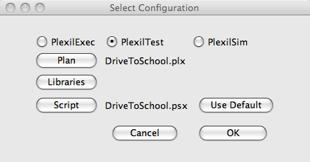
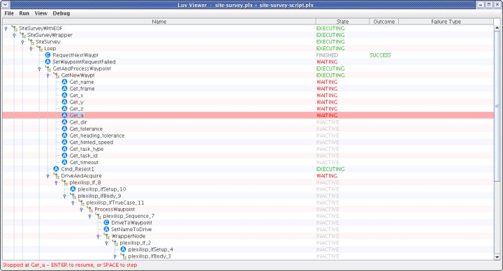
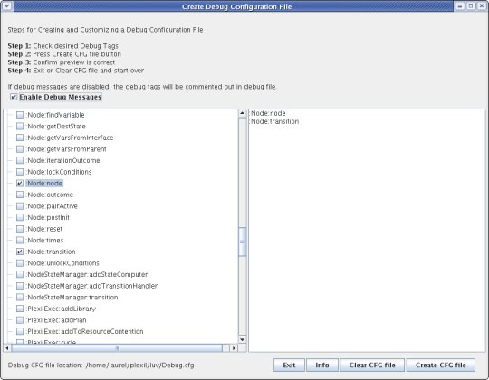
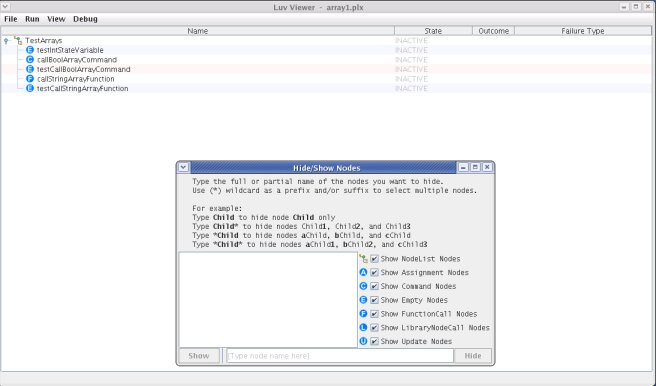

.. _PLEXILViewer:

PLEXIL Viewer
================

*8 May 2015*

NOTE: As of May 22, 2019, the current version of the |PLEXIL| viewer is
broken -- it has a number of startup and usage bugs. We hope to have
someone working on this soon, but cannot guarantee anything. In the mean
time, please use |PLEXIL| in its command-line form. If you are inclined to
debug the viewer, the |PLEXIL| community welcomes any contributions!
Please contact plexildiscuss@gmail.com.

.. contents::

Introduction
------------

The Plexil Viewer (formerly "**L**\ ightweight **U**\ niversal Executive
**V**\ iewer", or LUV), is a graphical interface for visualizing
execution of Plexil plans. It allows you to specify a desired |PLEXIL|
application, load plans and other supporting files, and monitor
execution of a plan while being able to set breakpoints and
interactively pause and resume the execution.

The |PLEXIL| Viewer allows you to execute Plexil plans using any of the
three Plexil applications provided in the |PLEXIL| software distribution:

-  The :ref:`Test Executive <test_executive>`
-  The :ref:`Plexil Simulator <PLEXILSimulators>`
-  The :ref:`PLEXIL Executive <PLEXILExecutive>`
-  External |PLEXIL| applications running independently of the Viewer
   *(documentation to be supplied)*

Here is an example of what plan execution looks like in the viewer.

.. figure:: ../_static/images/Executing.jpg

.. _using_the_plexil_viewer:

Using the PLEXIL Viewer
-----------------------

There are two different ways to use the |PLEXIL| viewer.

#. *Command line*: Run the |PLEXIL| application from the Unix command
   line, specifying the viewer as command line options.
#. *Graphical*: Start the |PLEXIL| viewer, and from here select and run
   the desired application.

The following sections describe both the command line and graphical
means for running |PLEXIL| applications. We give detailed instructions for
running the :ref:`Test Executive <test_executive>` application. The
process for running the other |PLEXIL| applications with the |PLEXIL| viewer
is almost identical.

.. _executing_plans_with_the_test_executive:

Executing Plans with the Test Executive
---------------------------------------

See the :ref:`PLEXIL Simulators <PLEXILSimulators>` chapter for an
introduction to the Test Executive and ``plexiltest`` command.

.. _command_line_approach:

Command line approach
~~~~~~~~~~~~~~~~~~~~~

Type one of the following, equivalent, commands at a Unix prompt. (The
second is an abbreviated form of the first).

.. code-block:: rst

    plexiltest -viewer -blocking -plan plan_file -script script_file
    plexiltest -v -b -p plan_file -s script_file

The ``-viewer`` or ``-v`` option says to open a viewer.

The ``-blocking`` or ``-b`` option says to open the viewer in *blocking*
mode, which means that plan execution is controlled interactively: the
space bar advances the plan by one
:ref:`step <micro_steps_macro_steps_and_the_quiescence_cycle>`, and the return key pauses and
resumes plan execution. This option is also required to allow setting
breakpoints in the plan. Note that use of this option significantly
slows the execution of the plan.

.. _graphical_approach:

Graphical approach
~~~~~~~~~~~~~~~~~~

#. Start the viewer by typing ``plexil`` (see additional detail in the
   subsection below).
#. Select ``File/Configuration``, which opens the *configuration dialog*
   (see image below).
#. Click the ``PlexilTest`` button.
#. Click ``Plan``, which opens a file browser. In this browser, find and
   select the desired Plexil plan (``.plx`` file).
#. If your plan uses library plans that are not found directly in the
   same directory as the plan, click ``Libraries`` to select the needed
   library plans. See the section on adding libraries below.
#. Select a simulation script. If your plan uses the empty script or a
   script file having the same base name as the plan, click the
   ``Use Default`` button next to the ``Script`` button. Otherwise,
   click ``Script``, which opens a file browser. In this browser, find
   and select the desired simulation script (``.psx`` file).
#. Click ``OK`` to capture these selections.
#. To execute the plan, select ``Run/Execute Plan`` in the main Plexil
   Viewer window or menu bar.

   config-dialog

.. _starting_the_plexil_viewer:

Starting the PLEXIL Viewer
^^^^^^^^^^^^^^^^^^^^^^^^^^

The |PLEXIL| viewer is started by typing ``plexil`` at a Unix shell
prompt. A single window will appear, showing the |PLEXIL| logo. On Linux
systems, the top of this window will have a set of pulldown menu
selections. Under MacOS, the pulldown menus appear in application menu
bar at the top of the computer screen.

.. _executing_plans_with_the_plexil_executive:

Executing Plans with the Plexil Executive
-----------------------------------------

See the :ref:`PLEXIL Executive <PLEXILExecutive>` chapter for an
introduction to the Plexil Executive and ``plexilexec`` command.

.. _command_line_approach_1:

Command line approach
~~~~~~~~~~~~~~~~~~~~~

Type one of the following, equivalent, commands at a Unix prompt. (The
second is an abbreviated form of the first).

.. code-block:: rst

    plexilexec -viewer -blocking -plan plan_file -config interface_config_file
    plexilexec -v -b -p plan_file -c interface_config

Note that the interface configuration file (-c/-config options) is
optional. If omitted the default ("dummy") configuration file is used.

.. _graphical_approach_1:

Graphical approach
~~~~~~~~~~~~~~~~~~

This approach is identical to the graphical approach for running the
Test Executive described above, except that the ``PlexilExec`` and
``Config`` buttons are selected in the configuration dialog. The
``Config`` button opens a file browser for selecting an interface
configuration file (XML format). If your plan does not need a specific
configuration file (i.e. it performs no external commands or lookups),
click ``Use Default`` to select the default (dummy) configuration.

.. _executing_plans_with_the_plexil_simulator:

Executing Plans with the Plexil Simulator
-----------------------------------------

See :ref:`Plexil Simulator <PLEXILSimulators>`
for an introduction to the Plexil Simulator and ``plexilsim`` command.

.. _command_line_approach_2:

Command line approach
~~~~~~~~~~~~~~~~~~~~~

Type one of the following, equivalent, commands at a Unix prompt. (The
second is an abbreviated form of the first).

.. code-block:: rst

    plexilsim -viewer -blocking -plan plan_file -script simulation_script_file
    plexilsim -v -b -p plan_file -s simulation_script_file

.. _graphical_approach_2:

Graphical approach
~~~~~~~~~~~~~~~~~~

This approach is identical to the graphical approach for running the
Test Executive described above, except that the ``PlexilSim`` button is
selected in the configuration dialog.

.. _advanced_options:

Advanced options
----------------

There are additional, more advanced, command line options relevant using
any of the three Plexil application with a viewer.

.. _selecting_a_remote_host:

Selecting a remote host
~~~~~~~~~~~~~~~~~~~~~~~

If the viewer is running on a different machine than the Plexil
executive, specify the viewer's host using the ``-hostname`` or ``-h``
option followed by the host's name. You may also need to specify a port
number, as described in the next section.

.. _selecting_a_port_number:

Selecting a port number
~~~~~~~~~~~~~~~~~~~~~~~

The Plexil viewer connects with the Plexil executive using a Unix
*port*. There are a series of consecutive *port numbers* (starting with
49100) that the |PLEXIL| software dedicates to this connection. Port
selection is managed automatically such that multiple executives, each
with a viewer, should be able to run concurrently on the same machine.
There are several cases in which this automatic selection will not work,
in which case a specific port number must be specified:

-  There are multiple viewers running, and the desired one is not using
   the first default port 65400 (e.g. it is not the first viewer
   started).
-  The desired viewer's port number has been changed from its default
   selection (e.g. using the Debug/Change Server port option).

A specific port is specified on the command line with the ``-p`` option.
Here is what a full invocation of ``plexiltest`` might look like when
running with a remote viewer:

.. code-block:: rst

    plexiltest -viewer -blocking -hostname foo.bar.com -port 49102 
               -plan plan_file -script script_file

The above command line has been split to fit this document, but in
practice should be all one line. Here's the abbreviated form:

.. code-block:: rst

    plexiltest -v -b -h foo.bar.com -n 49102 -p plan_file -s script_file

.. _saved_settings:

Saved Settings
--------------

The last settings used by the |PLEXIL| viewer are automatically stored in
the hidden file ``$HOME/.luv``. There is normally no reason to inspect
this file, as it is managed by the viewer. Note that this setting file
will hold the last settings made in the *last* Plexil viewer that was
quit normally by a given user, even if multiple viewers had been used
simultaneously. If a viewer quits abnormally (e.g. crashes), the
settings file may not be updated.

.. _viewer_features:

Viewer Features
---------------

The following sections provide brief descriptions and snapshots of
various |PLEXIL| viewer features.

.. _expand_plan_view:

Expand Plan View
~~~~~~~~~~~~~~~~

-  Choose **View - Expand All**
-  Inversely, collapse plan view by choosing **View - Collapse All**

.. figure:: ../_static/images/Expandall.jpg

.. _node_information_window:

Node Information Window
~~~~~~~~~~~~~~~~~~~~~~~

-  **DOUBLE-CLICK** on a node to open node information window
-  Depending on the node, the node information window could contain a
   Conditions Tab, Variables Tab and various Action Tabs:

Conditions Tab

.. figure:: ../_static/images/Conditioninfo.png

Variables Tab

Assignment Action Tab

.. _plan_interruption_and_breakpoints:

Plan Interruption and Breakpoints
~~~~~~~~~~~~~~~~~~~~~~~~~~~~~~~~~

-  Choose **Run - Enable Breaks**
-  **RIGHT-CLICK** (Mac OS: **CTRL-CLICK**) on node to add a breakpoint
-  Choose **Run - Execute Plan**
-  Plan will pause at beginning of execution
-  Press **ENTER** to resume plan execution
-  Press **SPACE BAR** to step through a plan

.. _stop_execution:

Stop Execution
~~~~~~~~~~~~~~

During the execution of a plan, you are allowed the option of stopping
the execution of a plan or reloading a plan.

-  Choose **Run - Stop Execution**, OR
-  Choose **File - Reload**

.. _create_debug_configuration_file:

Create Debug Configuration File
~~~~~~~~~~~~~~~~~~~~~~~~~~~~~~~

During the execution of a plan, Debug Tags trigger debugging messages to
be sent from the executive. For example, the following Debug Tags would
tell the executive to send messages for the state transitions and the
final outcomes of every node:

.. code-block:: rst

    :Node:transition
    :Node:outcome

-  Choose **Debug - Create Debug Configuration File...**
-  Check the check boxes of the Debug Tags you want to enable and click
   **Create CFG file**
-  *NOTE: a preview of the Debug.cfg file is displayed in this window
   and the location of the actual file is displayed in the bottom of
   this window*
-  After the *Debug.cfg* file is created, the following additional
   information will appear in the Debug Window as you execute future
   plans
-  *NOTE: to open Debug Window choose Debug - Show Debug Window*

.. _find_nodes:

Find Nodes
~~~~~~~~~~

-  Choose **View - Find...**
-  Type the exact name of the node you wish to locate and press
   **ENTER**
-  To locate any node starting with a name you choose, type the partial
   name with a wild card (*) at the end and press **ENTER**
-  To locate any node ending with a name you choose, type the partial
   name with a wild card (*) at the beginning and press **ENTER**
-  To locate any node containing a name you choose, type the partial
   name with a wild card (*) at both ends and press **ENTER**

.. _hide_nodes:

Hide Nodes
~~~~~~~~~~

-  Choose **View - Hide/Show Nodes...**
-  Uncheck the check boxes of the node types you want to hide
-  Type the exact name of the node you wish to hide and click **Hide**
-  To hide any node starting with a name you choose, type the partial
   name with a wild card (*) at the end and click **Hide**
-  To hide any node ending with a name you choose, type the partial name
   with a wild card (*) at the beginning and click **Hide**
-  To hide any node containing a name you choose, type the partial name
   with a wild card (*) at both ends and click **Hide**

.. _temporal_plan_viewer:

Temporal Plan Viewer
--------------------

The Gantt/Timeline Temporal Plan Viewer (distinct from the Plexil Viewer
described above) allows for the post-execution visualization of |PLEXIL|
plans over time via a Gantt chart or a series of timelines. The viewer
can be used with plans run via the plexilsim or plexilexec executives.
The ``plexiltest`` executive does not allow for this feature.

.. _using_the_viewer:

Using the viewer
~~~~~~~~~~~~~~~~

#. Add **<Listener ListenerType="GanttListener" />** to an interface configuration XML file associated with any
   plan(s) you wish to test with the viewer.
#. Run the plans you want to test with the viewer via ``plexilexec`` or
   ``plexilsim``.
#. Open the HTML file that is stored in the same directory that you run
   plans from; each HTML file corresponds to the execution of a single
   plan. It is recommended that you use Mozilla Firefox or Safari;
   Google Chrome is not supported. The naming convention for HTML files
   is *gantt_x_y.html* where *x* is the system process ID of the plan's
   execution and *y* is the name of root node in the executed plan. JSON
   files associated with each plan are stored in the same directory
   under a folder called "json" with the naming convention *x_y.html*
   where *x* and *y* are as stated above.
#. To observe specific information about a node, click on its token
   line. Within the draggable dialog window that opens, a number of node
   characteristics can be observed. Local variables in blue font
   indicate variables that have changed in value during that node's
   execution. Additional display characteristics of the Gantt viewer
   window can be modified using the buttons at the top of the viewer.
   The functionality of these buttons is detailed below.
#. When finished, it is recommended that you click Reset to defaults
   within the HTML browser window you are viewing so that all
   cookies/local storage is cleared after each use. This will also
   prevent your display characteristics from persisting when viewing
   another plan in new window at a later time. If you would like to
   preserve your display settings, simply close the browser window.

.. _important_additional_notes:

Important additional notes
~~~~~~~~~~~~~~~~~~~~~~~~~~

-  Javascript and cookies must be enabled within your browser.
-  Safari and Firefox are the only browsers tested successfully, with
   Safari working better.
-  In the case of long plans, the browser may prompt you to end a slow
   script because the viewer is taking longer than the browser's
   permissible time to process the plan's data. You'll need to authorize
   the script to continue running. To prevent the prompt from showing up
   in Safari, you can:

:# Open Safari preferences, click the Advanced tab,

:# Check the box that says "Show Develop menu in menu bar," and then

:# Click Disable Javascript Runaway Timer under the new Develop menu
item that appears at the top of the screen. This will allow scripts to
run to completion. In Firefox, the prompt will appear once, and you
should then be able to check a box within the prompt window that
prevents further prompts.

-  If tokens are not being displayed as you would expect, or certain
   tokens appear to be missing, it is best to first click Reset to
   defaults at the top of the viewer window. This will clear any
   settings that are stored via cookies and may be affecting the way in
   which tokens are being displayed.
-  The loading time for the viewer is variable, but long plans have been
   known to take many minutes to load. Shorter plans may load instantly.
-  The Gantt view can only be displayed after your plan has completed
   its execution. Trying to open a Gantt window during execution will
   either not work or a Gantt window corresponding to a prior plan's
   execution will be displayed.

.. _how_it_works:

How it works
~~~~~~~~~~~~

The viewer, written in Javascript, works by parsing data from a
formatted set of JSON tokens and displaying tokens on timelines through
use of this parsed data. The JSON tokens are generated in a single file
by the Gantt Listener interface that gathers information from nodes when
they reach their *Executing*, *Finished* or *Failed* states within a
plan's execution. Below is a screenshot of the viewer:

.. figure:: ../_static/images/GanttViewer.png
   :alt: 800 px|alt=PLEXIL Gantt/Timeline Temporal Plan Viewer

   Timeline Temporal Plan Viewer

The root node of a plan has a blue token line, while its immediate
children have green token lines. All other nodes have brown token lines.
The bolded names on the left represent the names of parent nodes, while
the names of each node represented on the token line are not bolded and
are below their corresponding parents. Looping nodes are represented
sequentially on the same token line. The *Pixels per time increment*
options allows for the manipulation of the spacing between the dark grey
gridlines that represent time increments. The *Token height* option
modifies the height of each colored token box in pixels. These two
options essentially allow for zooming in and out. The *Scale down*
feature will more drastically modify the zoom of the plan by zooming out
by powers of ten. The token lines themselves each display the name of
the node they represent and the duration of the node's execution.

Various buttons at the top of the Gantt Viewer window allow for the
customization of the way tokens are displayed. Here is a brief
description of each button's functionality:

-  Close all dialogs - Closes any open dialog windows that are displayed
   node information (three are open in the screenshot above).
-  Toggle generated nodes - Displays or hides nodes that are generated
   by the |PLEXIL| executive during runtime; these are nodes that have
   names that are prefaced with *ep2cp\_*, *plexilisp\_*, or
   *\__CHILD_\_*. By default, generated nodes are hidden.
-  Toggle timeline/expanded - Switches between an expanded Gantt-style
   view and a condensed timeline view. The Gantt-style view displays
   each node's token on it's own separate timeline. The timeline view
   condenses child node tokens to all fit on the line of their parent
   node. To observe concurrence, use the expanded Gantt-style view.
-  Toggle options box - Displays or hides the options box at the top of
   the viewer that allows control of certain display characteristics.
-  Resize - After resizing the browser window, clicking this button will
   resize the Gantt chart container within the viewer such that it's
   width fits within the newly-sized window.
-  Reset to defaults - Destroys all existing cookie values such that the
   viewer window's settings are returned to default. It is recommended
   that you click this after viewing a plan.
-  Hide specific nodes - Allows for the specification of specific nodes
   that should be hidden on the viewer. Either type the full name for
   each node or use the wildcard \* character to represent a sequence of
   any characters. Separate node names with commas.

