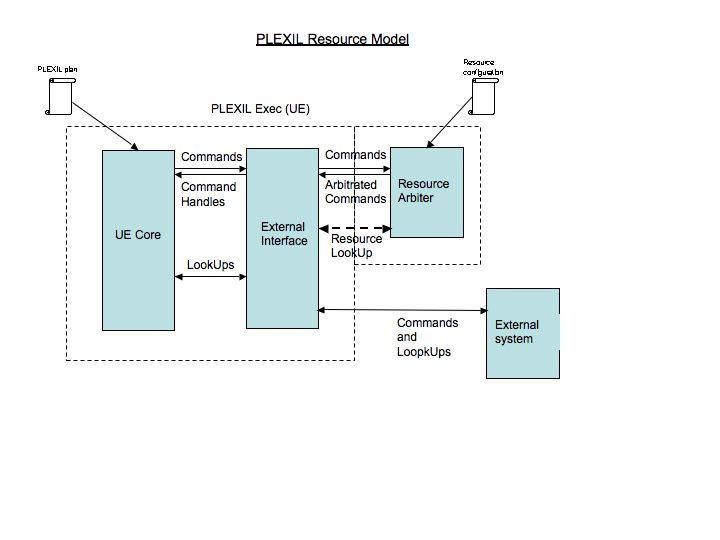
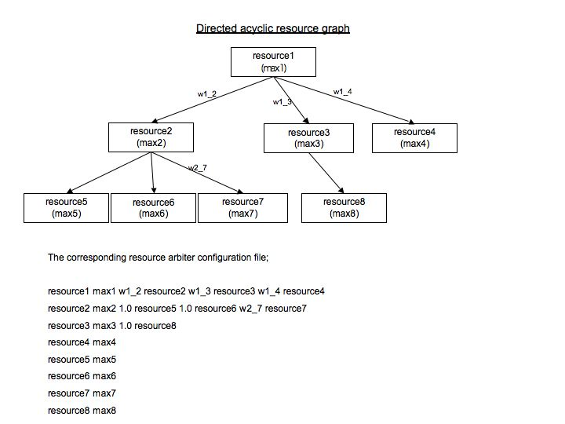

.. _ResourceArbiter:

ResourceArbiter
=================

*26 Jan 2023*

This chapter describes in greater detail |PLEXIL|'s *resource arbiter*,
which was introduced in the :ref:`Resource Model <ResourceModel>` chapter.

.. contents::

Design
------

The Resource Arbiter, a component of the |PLEXIL| Executive, tracks
resource usage during plan execution against resource limits, and
prevents the execution of commands whose resource requirements would
violate those limits.  The diagram below gives an overall idea of the
resource model implemented in the executive. (Note: *UE*, which stands
for *Universal Executive*, is an outdated name for the *PLEXIL
Executive*).

The resource arbiter sits between the Executive and the external
interface, and mediates command execution.  The Executive sends
commands and their resource requirements to the resource arbiter.  The
arbiter's task is to select the largest subset of commands which can
be executed without exceeding resource usage limits.  The selected
commands are forward to the external interface; those commands not
selected are marked as denied.  The plan can allow for this
possibility, and attempt to retry denied commands at a later time.

Capabilities
------------

The resource arbiter provides the following capabilities:

-  Tracks resource usage throughout plan execution;

-  Arbitrates commands competing for resources;

-  Takes command priority into account during arbitration;

-  Prevents resource over-allocation.

The resource arbiter does not:

-  Query the external system;

-  Consider command duration.

.. _the_basic_algorithm:

The Basic Algorithm
-------------------

#. The arbiter accepts a command only if *all* the command's resource
   requests can be satisifed, at the instant the command is eligible
   for execution.
#. Requested resources are presumed to be consumed (generated) when
   a command begins execution, and returned (removed) when that
   command finishes execution.
#. The arbiter evaluates resource requests in priority order, from
   best (smallest numerical priority value) to worst (largest value).
#. If multiple commands have the same priority, the arbiter will
   evaluate their requests in an arbitrary order.
#. The arbiter accepts the maximal subset of commands whose resource
   requirements, combined with the resources already allocated to
   previously executed commands, will not exceeed resource
   limitations.

Limitations of the current implementation
------------------------------

The current implementation of the resource arbiter differs from the
|PLEXIL| language specification as follows:

#. The resource arbiter uses the priority value of a command's first
   resource requirement, and ignores the priorities of any remaining
   requirements.
#. Lower bounds of resource requirements are ignored.

A future |PLEXIL| release will eliminate per-resource priorities and
resource lower bounds from the language.

.. _resource_configuration_file:

Resource Configuration File
---------------------------

The resource arbiter obtains the identity of resources from the
command itself.  When all commands using a particular resource have
completed, the resource arbiter purges the resource from its database.

The default initial value for a resource is 1.0.

*A priori* resource availability, and other properties, can be
specified in a *resource data file*, read by the resource arbiter at
|PLEXIL| Executive startup.  The default location for this file is
``resource.data`` in the current working directory.  Other locations
for the resource data file can be specified on the Executive command
line by using the ``-r`` option.

In its simplest form, the resource data file contains a list of
resource names with their total availability.

The resource file can also specify interdependencies between
resources.  These dependencies can be represented in the form of a
weighted Directed Acyclic Graph.  The schematic shown below shows the
general structure of such a graph and the format of the configuration
file. The weights represent the absolute value of the resource usage.

**FIXME: this really needs more exposition**
  

Several example resource data files can be found in the directory
``plexil/examples/resources``.
