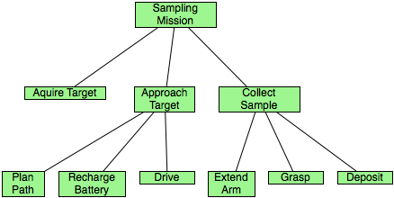
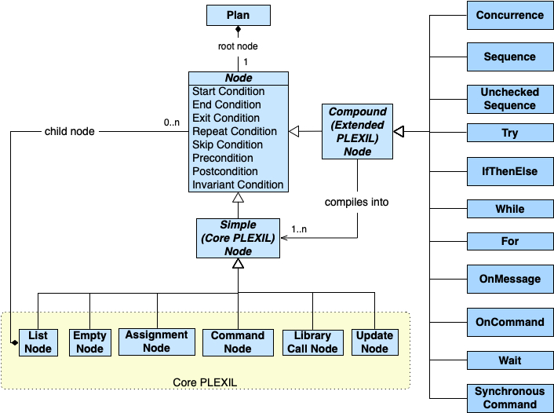

.. _PLEXILOverview:

PLEXIL Overview
====================

*16 Jan 2024*

.. contents::

What is PLEXIL?
---------------

Plan execution is a cornerstone in autonomy applications, such as
robotics, unmanned vehicles and habitats, and systems or simulations
involving intelligent software agents. |PLEXIL| (*PL*\ an E\ *x*\ ecution
*I*\ nterchange *L*\ anguage) is a language for representing plans for
automation.

|PLEXIL| was designed to meet the requirements of flexible, efficient and
reliable plan execution in space mission operations. It is compact,
semantically clear, and deterministic given the same sequence of events
from the external world. At the same time, the language is quite
expressive and can represent branches, loops, time- and event- driven
activities, concurrent activities, sequences, and temporal constraints.
The core syntax of the language is simple and uniform, making plan
interpretation simple and efficient, while enabling the application of
validation and testing techniques.

Accompanying |PLEXIL| is an execution engine, or *executive*, which
implements efficiently the |PLEXIL| language and provides interfaces to
controlled systems as well as decision support systems from which plans
may be sent. The |PLEXIL| software suite also includes a graphical plan
execution viewer, a static plan checker, and two different plan
simulators.

|PLEXIL| was originally developed as a collaborative effort between
researchers at NASA and Carnegie Mellon University, funded by NASA's
Mars Technology Program through the Research Institute for Advanced
Computer Science (RIACS) in the Universities Space Research Association
(USRA). Since then it has continually evolved through application on
NASA projects, which have included the control of prototype planetary
rovers and habitats, drilling equipment, and demonstration of adjustable
automation for International Space Station operations. See the
:ref:`References <references>` for more information on the background and
applications of |PLEXIL|.

.. _plexil_overview:

Overview
--------

This section is a short overview of the |PLEXIL| language. It describes
abstractly the main features of |PLEXIL|, and explains how one programs in
|PLEXIL|. The next chapter, :ref:`PLEXIL Reference <PLEXILReference>`,
describes in detail the programming constructs of |PLEXIL|. The :ref:`Detailed Semantics <PLEXILSemantics>`
chapter covers |PLEXIL| execution in
greater depth.

.. _data_types:

Data Types
----------

|PLEXIL| provides 4 *scalar* data types, one-dimensional *arrays*
of each scalar type, and the distinguished value *unknown*.

-  The **Boolean** type consists of two values, **true** and **false**,
   which can also be represented as 1 and 0 respectively.
-  The **Integer** type represents 32-bit two's complement integers. It
   is equivalent to the C ``int32_t`` type.
-  The **Real** type represents 64-bit IEEE 754 floating-point
   numbers. It is equivalent to the C ``double`` type.
-  The **String** type represents character strings of any length.
   |PLEXIL| strings are represented internally as C++ ``std::string``
   values.

|PLEXIL| arrays are homogenous. They have a declared maximum size, and
an actual size, which may be less than the maximum. Array elements are
initialized to *unknown* by default.

There is an additional "catch-all" type, **Any**, which is legal only
in parameter declarations for Commands and Lookups.

.. _expressions:

Expressions
-----------

|PLEXIL| expressions are *strongly typed*.  The only implicit type
conversion is from Integer to Real. Arithmetic expressions will be
promoted to Real if any subexpression is of Real type. Arithmetic
expressions of solely Integer values will yield Integer values. Note
in particular that Integer division yields an Integer value, as in C.

To convert a Real value to an Integer, one must use an explicit
conversion operator such as ``round()``, ``floor()``, ``ceil()``, or
``trunc()``.

Any expression, irrespective of declared type, may evaluate to
*unknown*. This includes Boolean expressions. The ``isKnown()``
operator returns ``false`` if its argument is *unknown*, ``true``
otherwise.

Nodes
~~~~~

A |PLEXIL| plan is built from *nodes*

.. note::
    *nodes* were once called *actions*

A node specifies something to do, either within the plan
itself, or to the external world. Nodes are the composable building
blocks from which arbitrarily complex behaviors can be specified. There
are many kinds of nodes in |PLEXIL|, and each is a programming construct
specifying a certain behavior.

A |PLEXIL| plan is a tree of nodes, with a single *root node*. This
tree represents a hierarchical decomposition of tasks. High level
tasks are closer to the root node, while leaf nodes represent
primitive behaviors such as assigning to a variable or sending a
command to the external system.

The following diagram exemplifies a simple hierarchical plan. Its
representation in |PLEXIL| would have a similar tree structure.

--------------

Let's meet the nodes. The following UML diagram illustrates the essence
of |PLEXIL|.

.. _core_plexil:

Core PLEXIL
~~~~~~~~~~~

The bottom row of nodes in the diagram above are *simple nodes* and
constitute a subset of the language called *Core PLEXIL*. These six
nodes provide all the computational power of |PLEXIL|. In fact, all the
compound nodes described above and shown on the right side of the
diagram are translated into a tree of simple nodes prior to execution.
Only Core |PLEXIL| is directly executed by the |PLEXIL| executive; the final
plan executed is a single tree of simple nodes.

Core |PLEXIL| consists of six node types. Four of these are *leaf*
node types:

-  An *empty node* can contain only attributes and performs no action.
-  An *assignment node* performs a local computation, whose value is
   assigned to a variable.
-  A *command node* issues commands to the system being operated on.
-  An *update node* provides information to the planning and
   decision-support interface.

There are two *interior* node types:

-  *List nodes* can contain any number of *child nodes* (or "children")
   of any node type. A List node is called the *parent node* (or
   "parent") of its children. In the absence of explicit sequencing
   conditions, all the children of a List node execute in parallel.
-  A *library call node* invokes a node defined in an external
   library. A Library Call node can be thought of as a macro call,
   which is expanded into a copy of the called node when the plan is
   loaded. Parameters are passed by reference into the called node.

The top node in a plan is called its *root node*.

.. _overview_extended_plexil:

Extended PLEXIL
---------------

Stacked in a column on the right side of the diagram are the kinds of
*compound nodes*, which specify higher level control constructs.

-  *Concurrence* nodes group child nodes to be executed in parallel.
-  *Sequence*, *Unchecked Sequence*, and *Try* nodes group child
   nodes to be executed in the order listed, in various different ways.
-  *IfThenElse* nodes conditionally execute their child nodes based
   upon the values of one or more Boolean expressions.
-  *Do*, *While*, and *For* nodes iterate over their child nodes as
   implied by their names.
-  The *OnMessage* and *OnCommand* nodes are used in multi-executive
   applications. They specify behavior in response to a received
   message or command, respectively.

Nodes are described in greater detail in the :ref:`Plexil Reference <PLEXILReference>` chapter.

.. _overview_conditions:

Conditions
~~~~~~~~~~

A node can specify up to eight explicit *conditions*. Conditions are
Boolean expressions which dictate a node's execution and outcome. Note
that |PLEXIL| implements a *ternary* logic in which Boolean expressions
evaluate to one of True, False, or Unknown.

There are nominal control conditions that specify when the node should
start executing, when it should finish executing, when it should be
repeated, and when it can be skipped. These are referred to
collectively as the node's *gate conditions*.

-  A *start condition* specifies when the node should start execution.

-  A *skip condition* specifies when the node's execution should be
   bypassed altogether.

-  An *end condition* specifies when the node should finish its
   execution.

-  A *repeat condition* specifies when the node should be made eligible
   for a repeat execution.

Next, there are failure conditions that identify when execution is not
successful, and these are referred to collectively as a node's *check
conditions*.

-  A *precondition* is checked immediately after the start condition
   becomes true. If this check fails, the node will be aborted and have
   an outcome of Failure. Preconditions are often used to verify that it
   is "safe" to execute the node.

-  A *postcondition* is checked after the node has completed execution.
   If this check fails, the node has an outcome of Failure.
   Postconditions are often used to verify that a node had the intended
   effect.

-  An *invariant condition* is checked during node execution, and if it
   becomes False at any point, the node will be aborted and have an
   outcome of Failure. Invariant conditions are often used to monitor
   conditions that are needed for the safe continued execution of the
   node.

Finally, there is a condition that says when to terminate a node
"prematurely" (i.e. before its end condition is satisfied), though
intentionally.

-  An *exit condition* is checked during node execution, and if it is
   satisfied at any point, the node will be terminate with an outcome of
   INTERRUPTED. The Exit condition can be used to effect deliberate plan
   cancellation. It is effectively the dual of the Invariant condition,
   which when false has the same effect but with a failure outcome.

.. _overview_variables:

Variables
~~~~~~~~~

A node may declare variables, which have *lexical scope*, i.e. they are
accessible to the node and all its descendants, but not siblings or
ancestors. Access to variables (for reading or writing) can be
restricted by use of *interfaces* in nodes. Interfaces are described in
the next chapter.

|PLEXIL| variables are *strongly typed*. They may only be assigned
values of their declared types. The sole exception to this rule: Real
variables may be assigned an Integer value, because every Integer can
be exactly represented as a Real value.

Variables lacking an explicit initial value are initialized to *unknown*.

.. _state_outcome_and_introspection:

State, Outcome, and Introspection
~~~~~~~~~~~~~~~~~~~~~~~~~~~~~~~~~

A node is always in one of seven states, and always terminates with one
of four outcomes. The exact semantics for this behavior in Core |PLEXIL|
is given in the :ref:`Node State Transition Diagrams <NodeStateDiagrams>`.
A node can (e.g. in one of
its conditions) query the state and outcome of itself, its parent,
children, and siblings, but no other nodes; it can also query the start
and end times of any given state of these nodes.

.. _external_world:

External World
~~~~~~~~~~~~~~

|PLEXIL| reads the state of the external world or system through
*lookups*, which come in several varieties. |PLEXIL| can affect the state
of the external world or system through *commands*, which are sent
asynchronously.

Time
~~~~

Time (durations, elapsed time, clock time, etc) is often an essential
concept in automated and simulated systems. |PLEXIL| has no native concept
of time, per se. Time in |PLEXIL| is just another external state, and
|PLEXIL| has predefined the state named ``time`` for its operations that
involve time. The expressions in |PLEXIL| that *imply* time, i.e. those
that give the start and end times of node states, rely on the ``time``
external variable, which at present is a unitless real number.

Resources
~~~~~~~~~

|PLEXIL| has a simple resource model, described in detail in :ref:`Resource Model <ResourceModel>`.
In short, resource requirements for commands
(only) can be specified in command nodes, and these requirements are
checked during execution via a resource arbitration mechanism. Simple
models of unary, non-unary, hierarchical, and renewable resources are
supported.

Programming in PLEXIL
~~~~~~~~~~~~~~~~~~~~~

.. _standard_plexil:

Standard Plexil
^^^^^^^^^^^^^^^

The C-like syntax described in this manual is that of Standard
|PLEXIL|.  The compiler for Standard |PLEXIL| translates user programs
into Core |PLEXIL| XML. The compiler is described in the :ref:`next
chapter <PLEXILReference>`.

Note that the terms "PLEXIL" and "Plexil" can refer to the abstract
|PLEXIL| language (nodes) and/or to its standard programming syntax.

.. _plexil_and_xml:

PLEXIL and XML
~~~~~~~~~~~~~~

As mentioned in the previous section, the executable form of |PLEXIL| is
represented in XML (Extensible Markup Language), a widely used standard
for information modeling. Although a |PLEXIL| user does not normally need
to be concerned with XML, it is important to note that the formal
specification of |PLEXIL|'s syntax is given at the XML level. Core |PLEXIL|
is specified by *XML schemas*. More information about |PLEXIL| XML is
given in the chapter titled :ref:`PLEXIL, XML, and Emacs <XMLSchemaEmacs>`.

.. _the_plexil_community:

The PLEXIL Community
--------------------

If you have problems installing or using PLEXIL, find bugs in it, or
have feature requests, please open an issue at
https://github.com/plexil-group/plexil/issues.

If you have questions about PLEXIL, please contact the support team
at ``plexil-support (at) groups (dot) io``.
