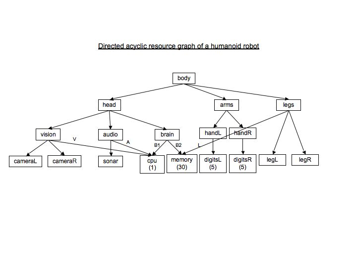

.. _HierarchialResources:

Hierarchial Resources 
========================

*12 May 2015*

There are several situations where the resources needed by a command are
related. When a large number of resource elements are involved, it might
be cumbersome to specify each resource element in the plan although such
an approach is entirely possible. The resource arbiter allows for the
user to load a configuration file when the resource interdependence can
be captured via a weighted directed acyclic graph. When the user
specifies a particular resource requirement in the plan, all the
children of that resource also get pulled in.

In addition to resources that can be specified in the PLEXIL plan, the
resource arbiter allows for loading a configuration file that captures
the inter-relationships between the resources. Consider the structure
given below.
  

Consider a plan (found in plexil/examples/resource3.ple) that has
three commands ``C1``, ``C2`` and ``C3`` where ``C1`` needs the
``head`` resource with priority 20, ``C3`` needs the ``vision``
resource with priority 30 and ``C2`` needs 0.3 units of the ``memory``
resource at a priority of 25.

For the given resource structure since ``C1`` requires the head
resource, it will also need all its children that includes the vision
resource and in addition given the higher priority level, ``C1`` will
end up locking out ``C2``. The status of ``C3`` will depend on the the
weight B2, which is the amount of memory that the head resource will
need. It is easy to see that ``C2`` will be accepted if B2 < (30-0.3).

The entire PLEXIL plan is shown below;

::

   Integer Command c1;
   Integer Command c2;
   Integer Command c3;

   SimpleTask: 
   Concurrence {
     C1: {
       Integer returnValue = -1;
       EndCondition returnValue == 10;
       PostCondition C1.command_handle == COMMAND_SUCCESS;
       Resource Name = "head", Priority = 20;
       returnValue = c1();
     }
     C2: {
       Integer returnValue = -1;
       RepeatCondition C2.command_handle == COMMAND_DENIED;
       PostCondition C2.command_handle == COMMAND_SUCCESS;
       EndCondition returnValue == 10;
       Resource Name = "memory",
         LowerBound = 0.3, 
         UpperBound = 0.3,
         Priority = 25;
       returnValue = c2();
     }
     C3: {
       Integer returnValue = -1;
       PostCondition C3.command_handle == COMMAND_SUCCESS;
       EndCondition returnValue == 10;
       Resource Name = "vision", Priority = 30;
       returnValue = c3();
     }
   }
