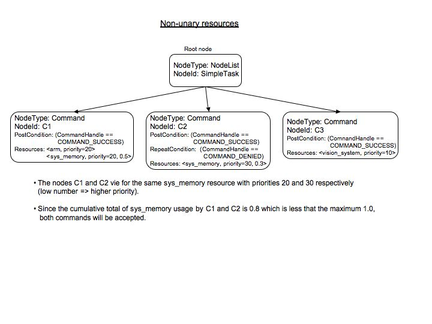

.. _NonUnaryResources:

Non-Unary Resources
======================

*26 Jan 2023*

This example, which can be found in
``plexil/examples/resources/resource2.ple``, differs from the unary
resource example in that ``sys_memory`` is allocated in fractional
amounts, rather than as a whole.  This is indicated by the keyword
``UpperBound`` in the resource usage specification.  (If
``UpperBound`` is not supplied, the requested amount defaults to 1.0.)

In this example,

- Node ``C1`` command ``c1`` requires ``arm`` and 0.5 of ``sys_memory`` at priority 20
- Node ``C2`` command ``c2`` requires 0.3 of ``sys_memory`` at priority 30
- Node ``C3`` command ``c3`` requires ``vision_system`` at priority 10

The file ``plexil/examples/resources/resource2.data`` specifies that
1.0 units of each resource are available.

::

   %Contains the resource hierarchy
   % name initial-resource [child-weight child-name]*
   arm 1.0
   sys_memory 1.0
   vision_system 1.0

As in the previous example, all 3 nodes and their respective commands
are eligible to execute concurrently.  

The resulting outcome will be to accept all the commands since the
cumulative memory requirements of ``C1`` and ``C2`` is less than 1.0.

The PLEXIL plan is shown below:

::

   Integer Command c1;
   Integer Command c2;
   Integer Command c3;

   SimpleTask: 
   Concurrence
   {
     C1: {
       Integer returnValue = -1;
       EndCondition returnValue == 10;
       PostCondition C1.command_handle == COMMAND_SUCCESS;
       Resource Name = "sys_memory",
         UpperBound = 0.5,
         Priority = 20;
       Resource Name = "arm",
         Priority = 20;
       returnValue = c1();
     }
     C2: {
       Integer mem_priority = 30;
       Integer returnValue = -1;
       RepeatCondition C2.command_handle == COMMAND_DENIED;
       PostCondition C2.command_handle == COMMAND_SUCCESS;
       EndCondition returnValue == 10;
       Resource Name = "sys_memory",
         UpperBound = 0.3,
         Priority = mem_priority;
       returnValue = c2();
     }
     C3: {
       Integer returnValue = -1;
       Integer vision_priority = 10;
       PostCondition C3.command_handle == COMMAND_SUCCESS;
       EndCondition returnValue == 10;
       Resource Name = "vision_system",
         Priority = vision_priority;
       returnValue = c3();
     }
   }

