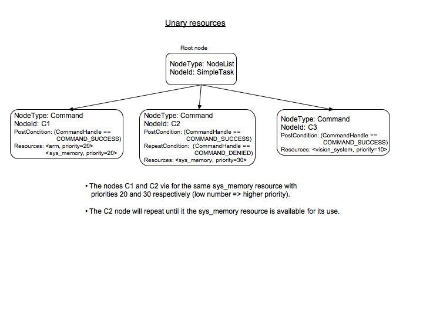

.. _SimpleUnaryResources:

Simple Unary Resources 
=========================

*13 Jan 2023*

This example demonstrates how |PLEXIL| handles unary command
resources, and how node priority is used to resolve contention for a
shared resource.

The example plan can be found at
plexil/examples/resources/resource1.ple, its associated resource file
at plexil/examples/resources/resource1.data, and a simulation script
at plexil/examples/resources/scripts/resource1.pst.  The debug trace
from running this example will be helpful in uderstanding how resource
arbitration works.

This example makes use of 3 unary resources, ``arm``, ``sys_memory``,
and ``vision_system``.  Each resource has a maximum quantity of 1.0.

Three Command nodes, ``C1``, ``C2``, and ``C3``, are scheduled to
start concurrently.  Each node's command has its own resource
requirements:

-  Node ``C1`` command ``c1`` requires resources ``arm`` and ``sys_memory``
-  Node ``C2`` command ``c2`` requires resource ``sys_memory``
-  Node ``C3`` command ``c3`` requires resource ``vision_system``

Each node has been assigned a priority:

-  Node ``C1`` has priority 20
-  Node ``C2`` has priority 30 (the value of variable ``mem_priority``)
-  Node ``C3`` has priority 10 (the value of variable ``vision_priority``)

At the first macro step, the resource arbiter receives all 3 requests,
and considers them in priority order: best (numerically smallest) to
worst (numerically larger).

Node ``C3`` and its command ``c3`` at priority 10 are considered
first.  The ``vision_system`` resource is available, so the resource
arbiter allocates it and accepts command ``c3``.

Next, the arbiter considers node ``C1`` and its command ``c1`` at
priority 20.  The requested resources ``arm`` and ``sys_memory`` are
both available, so the arbiter allocates both resources and accepts
command ``c1``.

Node ``C2`` and command ``c2`` at priority 30 are considered last.
The request for ``sys_memory`` cannot be satisfied, as all of this
resource is already allocated to command ``c1``.  So the arbiter
denies its request.

The result is that the |PLEXIL| Executive issues commands ``c1`` and
``c3``, and sets the command handle of ``c2`` to ``COMMAND_DENIED``.
This causes node ``C2`` to transition to ``ITERATION_ENDED``. Because
the PostCondition on node ``C2`` evaluates to ``false``, its outcome
is ``FAILED`` and its failure type is ``POST_CONDITION_FAILED``.

At the next macro step, the RepeatCondition on node ``C2`` makes it
eligible for execution.  But command ``c1`` has not finished
executing, so the arbiter rejects command ``c2`` again.

At the next macro step, command ``c1`` has finished, and the arbiter
releases its resources ``arm`` and ``sys_memory``.  Node ``C2`` and
command ``c2`` are eligible for execution again.  This time, because
``sys_memory`` is available, the arbiter allocates it, and accepts
``c2`` for execution.

The entire PLEXIL plan is shown below.

::

    Integer Command c1;
    Integer Command c2;
    Integer Command c3;

    SimpleTask:
    Concurrence
     {
     C1: {
         Integer returnValue = -1;
         EndCondition returnValue == 10;
         PostCondition C1.command_handle == COMMAND_SUCCESS;
         Resource Name = "sys_memory", Priority = 20;
         Resource Name = "arm", Priority = 20;
         returnValue = c1();
     }
     C2: {
         Integer mem_priority = 30;
         Integer returnValue = -1;
         RepeatCondition C2.command_handle == COMMAND_DENIED;
         PostCondition C2.command_handle == COMMAND_SUCCESS;
         EndCondition returnValue == 10;
         Resource Name = "sys_memory", Priority = mem_priority;
         returnValue = c2();
     }
     C3: {
         Integer returnValue = -1;
         Integer vision_priority = 10;
         PostCondition C3.command_handle == COMMAND_SUCCESS;
         EndCondition returnValue == 10;
         Resource Name = "vision_system", Priority = vision_priority;
         returnValue = c3();
     }
    }
